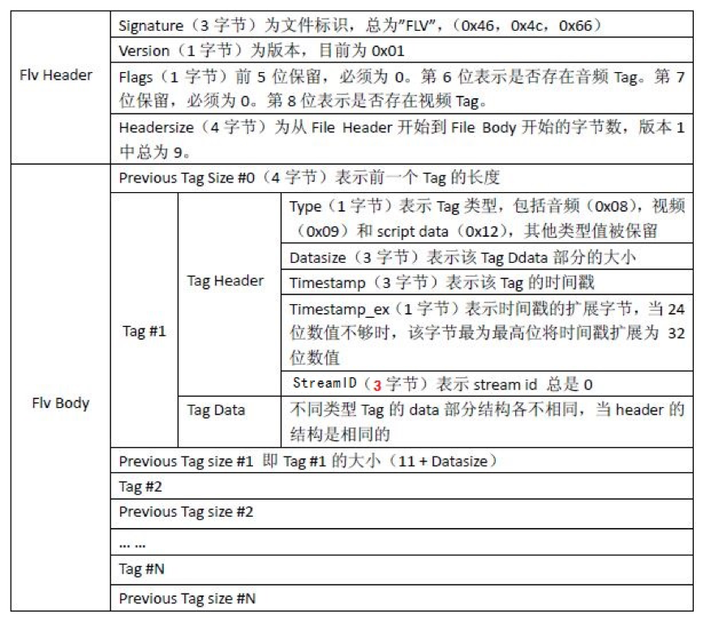

# FLV&H264资料整理


## FLV格式



FLV Header中有效信息为第5个字节，0x01 - 纯视频 0x04 - 纯音频， 0x05 - 音视频。


TagHeader type标识Tag携带的是什么类型的数据。不同类型解析方式也不同。 其中TagHeader中Timestamp(+ex)为dts。


## TAG解析

### MetaData

TagHeader: 0x12标识为MetaData。 MetaData采用AMF0编码，media-go代码中依赖 github.com/torresjeff/rtmp/amf/amf0 进行解析。在FLV中, MetaData有2个AMF0元素，第1个为OnMetaData string，第2个为ECMAArray。 

前者是固定的，后者显示视频的基本信息:

```shell
	height              :	720
	framerate           :	23.976023976023978
	audiosamplerate     :	48000
	compatible_brands   :	isomiso2avc1mp41
	videodatarate       :	1298.1533203125
	audiodatarate       :	333.255859375
	audiosamplesize     :	16
	audiocodecid        :	10
	encoder             :	Lavf58.45.100
	filesize            :	1.19534464e+08
	duration            :	600.177
	width               :	1280
	stereo              :	false
	videocodecid        :	7
	major_brand         :	isom
	minor_version       :	512
```

### Video

VideoTag Data的第1个字节标识帧类型(0-3bit)和视频编码类型(4-7bit)。

**帧类型**:  

​	1 - h264关键帧(IDR)  

​	2 - h264参考帧

**视频编码类型:** 

​	0x07 - H.264(AVC)编码


H264编码， VideoData后面4个字节仍然是视频信息数据:  

​	AVC Packet Type(1字节) ：

​			0 --- AVC Sequence Header，存储的PPS/SPS， 1 --- AVC  NALU   2 --- AVC  end of sequence

​	CTS (CompositionTime 3字节) ： pts = cts + dts


#### sps/pps

>第一个 video tag 一般存放的是 sps 和 pps。存储的格式：
>
>0x01 + sps[1] + sps[2] + sps[3] + 0xFF + 0xE1 + sps size + sps + 01 + pps size + pps
>
>其中 sps size 和 pps size各占两个字节。
>
>链接：https://www.jianshu.com/p/651deb57a6b4


FLV的第1个Video  Tag类型为SPS/PPS,  解码器需要有这些信息才能完成解码。 

VideoTag Data从第5个字节开始为正式内容。AVC Sequence Header:

```go
	buffer.ReadByte()         // Configuration VerSion
	buffer.ReadByte()         // AVC Profile SPS[1]
	buffer.ReadByte()         // profile_compatibility SPS[2]
	buffer.ReadByte()         // AVC Level SPS[3]
	b, _ := buffer.ReadByte() // lengthSizeMinusOne
	gNaluSize = (int(b) & 0x03) + 1

	spsNum := int(binary.BigEndian.Uint16(buffer.Next(2)))
	for i := 0; i < spsNum; i++ {
		spsSize := int(binary.BigEndian.Uint16(buffer.Next(2)))
		ParseSPS(buffer, spsSize)
	}

	b, _ = buffer.ReadByte()
	ppsNum := int(b)

	for i := 0; i < ppsNum; i++ {
		spsSize := int(binary.BigEndian.Uint16(buffer.Next(2)))
		ParsePPS(buffer, spsSize)
	}
```


SPS和PPS解码: 

​	这块其实也是层窗户纸，解析的时候，首先要做的是将RBSP给解析出来。

​	NALU = NALU Header + EBSP (EBSP是为了避免RBSP编码冲突，添加了一个防止竞争的字节:0x03)

> NALU的起始码为0x000001或0x00000001，同时H264规定，当检测到0x000000时，也可以表示当前NALU的结束。那这样就会产生一个问题，就是如果在NALU的内部，出现了0x000001或0x000000时该怎么办？
>
> 所以H264就提出了“防止竞争”这样一种机制，当编码器编码完一个NAL时，应该检测NALU内部，是否出现如下左侧的四个序列。当检测到它们存在时，编码器就在最后一个字节前，插入一个新的字节：0x03。


**NALU解析步骤参考文档**: H.264-AVC-ISO_IEC_14496-10-2012.pdf  : Page 61

另一个概念是指数哥伦布编码:  参考文档: H.264-AVC-ISO_IEC_14496-10-2012.pdf, page 227

>   // Syntax elements coded as ue(v), me(v), or se(v) are Exp-Golomb-coded.
> ​    //      leadingZeroBits = -1;
> ​    //      for( b = 0; !b; leadingZeroBits++ )
> ​    //          b = read_bits( 1 )
> ​    // The variable codeNum is then assigned as follows:
> ​    //      codeNum = (2<<leadingZeroBits) - 1 + read_bits( leadingZeroBits )


#### NALU

NALU封装格式有多种(印象中是3种)，对于NALU裸流来说，是通过0x0000001或者0x000001来分割。FLV中是通过NALU Length  + Data来划分。 

NALU前gNaluSize个字节（Sequence Header第5个字节表示）表示NALU的Length, 后面则是Video Slice数据。NALU的第1个字节携带的是NALU Info:

```GO
type Nalu struct {
	Len             int 
	ForbiddenBit    int // 第1位
	NalReferenceIdc int // 第2-3位
	NalUnitType     int // 后5位
}
```


#### SEI

TODO